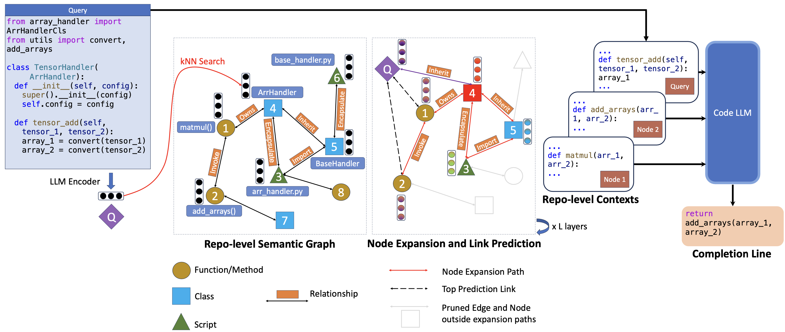

# RepoHyper: Better Context Retrieval Is All You Need for Repository-Level Code Completion

## Installation

```bash
pip install -r requirements.txt
```

## Architecture


RepoHyper is a two-stage model. The first stage is a search-then-expand algorithm on Repo-level Semantic Graph (RSG) then use GNN link predictor that reranks the retrieved results from KNN search and graph expansion. The second stage is any code LLM model that takes the retrieved context and predicts the next line of code.

## Checkpoints
We provide the checkpoints for the GNN model [here](https://ai4code.blob.core.windows.net/repohyper/model_10.pt). The GNN model is trained on the RepoBench-R dataset with gold labels. We also provide [RepoBench-R RGSs](https://ai4code.blob.core.windows.net/repohyper/repos_graphs_labeled_link_with_called_imported_edges) to reproduce the results.


## Usage

### Data preparation

We need to clone [Repobench dataset](https://github.com/Leolty/repobench/tree/main/data) into `data/repobench` folder. Then download all the unique repositories used in this dataset

```bash
python3 -m scripts.data.download_repos --dataset data/repobench --output data/repobench/repos --num-processes 8
```

The next step is to generate call graph using PyCG. We use the following command to generate call graph for each repository. 60 processes are used to speed up the process (maximum RAM usage is around 350GB).

```bash
python3 -m scripts.data.generate_call_graph --repos data/repobench/repos --output data/repobench/repos_call_graphs --num-processes 60
```

Now we need to generate embeddings for each node for node embedding as well as create adjacency matrix by aligning Tree-sitter functions, classes, methods with call graph nodes. 
```bash
python3 -m scripts.data.repo_to_embeddings --repos data/repobench/repos --call-graphs data/repobench/repos_call_graphs --output data/repobench/repos_graphs --num-processes 60
```

Final step is labeling which node is the most optimal for predicting next line using gold snippet from repobench dataset. In this step, we also generate the training data for GNN training by extracting the subgraph using KNN search and call graph expansion
```bash
python3 -m scripts.data.matching_repobench_graphs -k 10 -radius 10 --entities data/repobench/repos_graphs --output data/repobench/repos_graphs_labeled 
```

### Training
We can train GNN reranker seperately using following script

```bash
CUDA_VISIBLE_DEVICES=0 deepspeed train_gnn.py --deepspeed --deepspeed_config ds_config.json --arch GraphSage --layers 1 --data-path data/repobench/repos_graphs_labeled_cosine_radius_unix --output data/repobench/gnn_model --num-epochs 10 --batch-size 16
```

### Evaluation for RepoBench-P

We can evaluate the model using the following script

```bash
python3 scripts/evaluate_llm.py --data data/repobench/repos_graphs_matched_retrieved --model "gpt3.5" --num-workers 8
```